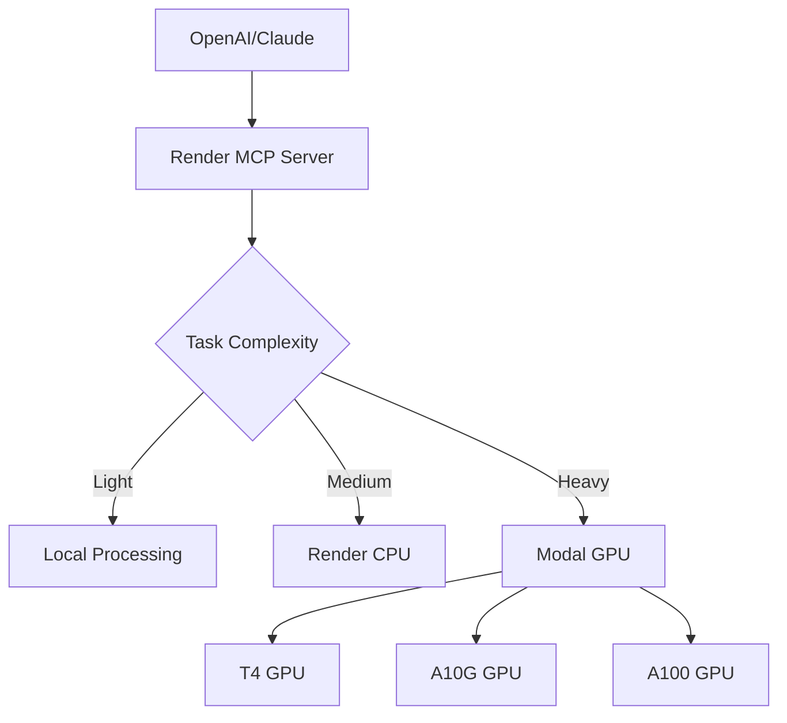

# Deployment Strategy: Render vs Modal for MCP Background Workers

## 🎯 Current Status
✅ **Smithery MCP Server**: Successfully deployed at https://17b5628c.ngrok.smithery.ai/mcp  
✅ **4 MCP Servers Configured**: All working with base64 encoded credentials  
✅ **Modal GPU Functions**: Ready for deployment  

## 🔍 Deployment Options Analysis

### Option 1: Render Background Worker ☁️

#### **Pros:**
- **Always-on**: 24/7 availability for MCP server
- **HTTP endpoint**: Direct REST API access
- **Integrated with existing Render MCP**: Single platform management
- **Cost predictable**: Fixed monthly cost
- **Auto-scaling**: Built-in load balancing
- **Environment management**: Easy config updates

#### **Cons:**
- **No GPU access**: CPU-only processing
- **Limited for heavy tasks**: Browser automation may be slow
- **Memory constraints**: Limited RAM for large datasets
- **No specialized hardware**: No AI acceleration

#### **Best for:**
- Lightweight MCP operations
- API orchestration and routing
- Always-available service endpoints
- Simple web scraping and data processing

### Option 2: Modal GPU Background Worker 🚀

#### **Pros:**
- **GPU acceleration**: T4, A10G, A100 available
- **AI-optimized**: Perfect for browser automation with vision
- **Parallel processing**: Multiple concurrent tasks
- **Cost-efficient**: Pay-per-use pricing model
- **Specialized hardware**: Optimized for AI workloads
- **Instant scaling**: Serverless auto-scaling

#### **Cons:**
- **Cold starts**: Initial latency for function startup
- **Pay-per-use**: Costs can vary with usage
- **Complexity**: More moving parts to manage
- **No persistent state**: Functions are stateless

#### **Best for:**
- Heavy browser automation with AI vision
- Large-scale web research and data processing
- GPU-accelerated tasks
- Parallel processing workloads

## 🎯 **Recommended Hybrid Strategy**

### **Best of Both Worlds Approach:**

#### **Primary MCP Server (Render)** 
```bash
# Deploy main MCP coordinator to Render
# Always-on service that routes tasks intelligently
```

- **Role**: Main MCP endpoint and task coordinator
- **Handles**: Lightweight operations, API routing, task distribution
- **Always available**: 24/7 HTTP endpoint for OpenAI integration
- **Cost**: ~$7-25/month predictable

#### **Heavy Processing (Modal GPU)**
```bash  
# Deploy GPU-accelerated functions to Modal
# Called by Render when heavy processing needed
```

- **Role**: GPU-accelerated browser automation and AI tasks
- **Handles**: Complex browser automation, large research, AI vision
- **Pay-per-use**: Only pay when GPU tasks are running
- **Cost**: ~$0.10-2.00 per hour when active

### **Intelligent Task Routing:**



## 🛠️ Implementation Plan

### Phase 1: Deploy Render MCP Server (Immediate)
```bash
# Deploy main MCP server to Render for 24/7 availability
render deploy --from-repo https://github.com/Bzcasper/say-hello-smithery-mcp
```

### Phase 2: Deploy Modal GPU Functions (Parallel)  
```bash
# Deploy GPU functions for heavy tasks
cd modal/
python deploy.py
```

### Phase 3: Intelligent Routing (Integration)
```javascript
// MCP server automatically routes based on task complexity
const routeTask = (taskType, complexity) => {
  if (complexity === 'low') return 'local';
  if (complexity === 'medium') return 'render';
  if (complexity === 'high') return 'modal-gpu';
};
```

## 💰 Cost Analysis

### **Render Only:**
- **Monthly**: $7-25 (always-on)
- **GPU tasks**: Slow/impossible
- **Total**: $7-25/month

### **Modal Only:**
- **Monthly**: $0 (when idle)
- **Active usage**: $0.10-2.00/hour
- **Heavy usage**: $50-200/month
- **Total**: Variable based on usage

### **Hybrid (Recommended):**
- **Render base**: $7-25/month
- **Modal GPU**: $10-50/month (typical usage)
- **Total**: $17-75/month with full capabilities

## 🚀 **Recommendation: Hybrid Deployment**

### **Deploy Both:**

1. **Render**: Main MCP server for 24/7 availability
2. **Modal**: GPU workers for heavy automation tasks
3. **Intelligent routing**: Automatic task distribution

### **Benefits:**
- ✅ **Always available** MCP endpoint
- ✅ **GPU acceleration** when needed  
- ✅ **Cost optimized** - pay for what you use
- ✅ **Best performance** for all task types
- ✅ **Future-proof** architecture

### **Quick Start Commands:**

```bash
# Deploy to Render (main MCP server)
git push render main

# Deploy to Modal (GPU functions)  
python modal/deploy.py

# Test integration
node smithery-deploy.js
```

## 🎯 **Next Steps:**

1. **Keep Smithery running** for development/testing
2. **Deploy to Render** for production MCP server
3. **Deploy to Modal** for GPU acceleration
4. **Configure intelligent routing** between platforms

This gives you the best of both worlds: reliable always-on service with powerful GPU acceleration when needed!